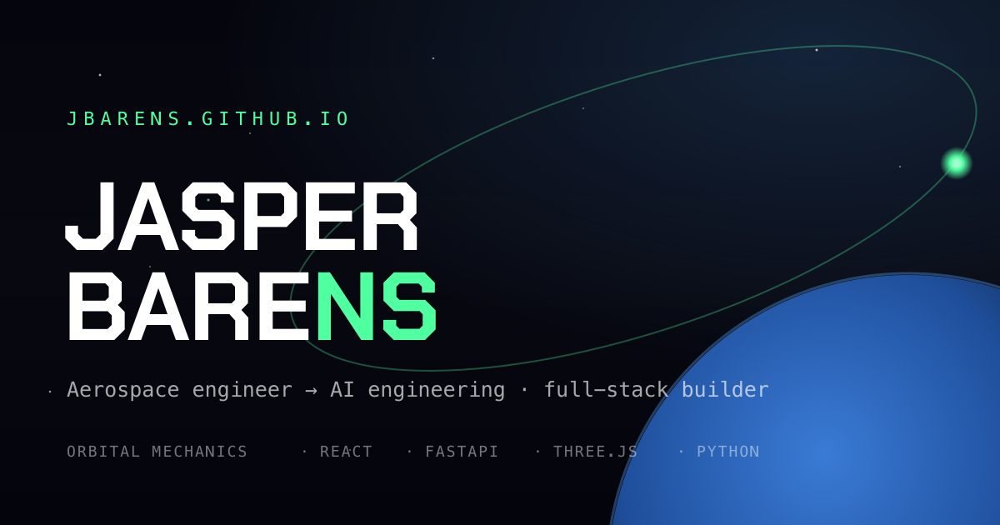

# jbarens.github.io

Personal portfolio of **Jasper Barens** — aerospace engineer building toward AI engineering.

🌍 **Live: [jbarens.github.io](https://jbarens.github.io/)**



## About the site

A single, self-contained `index.html` — no build step, no frameworks, no JS dependencies. The whole experience is a **scroll-as-orbital-descent**: scroll position maps to altitude, counting down from geostationary orbit (35,786 km) to touchdown, with the Earth rising to meet you.

Built by hand:
- Multi-layer parallax starfield on `<canvas>`, with depth and subtle mouse parallax
- Smoothed (lerped) `requestAnimationFrame` scroll engine
- Live altitude HUD + orbital-phase readout tied to scroll progress
- CSS-rendered Earth with stylised landmasses and a day/night terminator
- `IntersectionObserver` reveals and `prefers-reduced-motion` fallbacks
- Type: Chakra Petch (display) + JetBrains Mono (data)

## Structure

```
index.html      — the entire site
favicon.svg     — orbital mark
og.svg / og.png — social preview card (1200×630)
```

## Editing

Edit `index.html` in a code editor (not TextEdit — it rewrites the file as a broken export), then:

```bash
git add -A && git commit -m "update" && git push
```

GitHub Pages rebuilds automatically in ~30–60s.

To regenerate the social card after editing `og.svg`:

```bash
rsvg-convert -w 1200 -h 630 og.svg -o og.png
```

---

Content reflects my [LinkedIn](https://linkedin.com/in/jbarens) and CV. Find me at **jasper@barens.org**.
